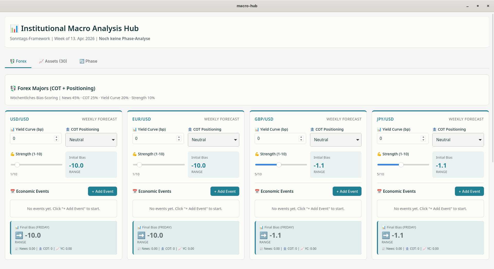

# 📊 IMA_App

IMA stands for "Institutional Macro Analysis". This app gives users the possibility to calculate the analysis of global economic interrelationships.

The following picture shows a possible preliminary preview of the ui of this app. \
_Hint: The final Result at the end could have some differences_

